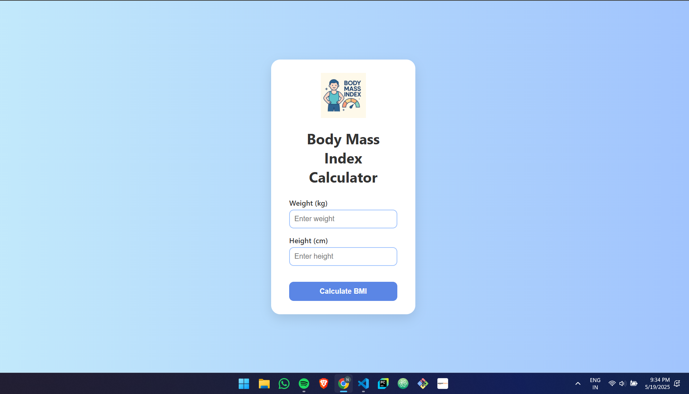

# BMI Calculator 🧮

A simple and beautiful BMI (Body Mass Index) Calculator built with HTML, CSS, and JavaScript. It lets users input their height and weight, and calculates their BMI with a visually appealing interface.

## 🚀 Features

- Light and Dark Mode Toggle 🌗  
- Instant BMI Calculation  
- Responsive and Clean UI  
- Visual Feedback with Illustration  

## 🛠️ Tech Stack

- HTML  
- CSS (Custom design + Vector image)  
- JavaScript (Basic DOM manipulation)

## 📸 Preview

## 📂 How to Use

1. Clone the repository.
2. Open `index.html` in your browser.
3. Enter your height and weight, then click "Calculate BMI".
